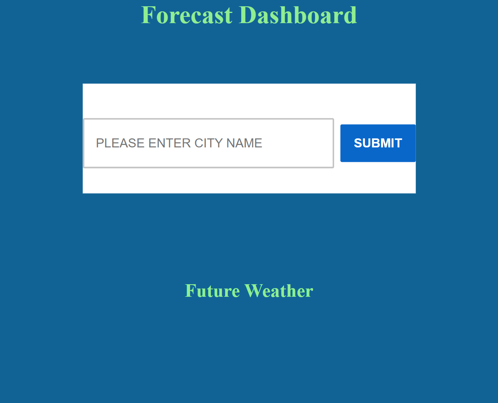

# Rain-or-Shine

## Description

In this challenge, I was supposed to learn how to do a future forecast but was only able to do the current one. I struggled through this assignment so I am sorry.

The purpose was to show the current and future forecasts for a given city as well as use localStorage and other icons to save the weather information.

## Installation

Modified HTML, CSS, and JS scripts for the exercise.

Called certain API's for current and future weather.

Completed code pushed to GitHub.

GitPages used for deployed website.

## Usage

The end user should be able to get current weather information.

## Links

Repository: (https://github.com/AbeThomas82/Rain-or-Shine)
GitPage: (https://abethomas82.github.io/Rain-or-Shine/)

## Screenshot

## Credits

TA's of AskBCS

Lee Stevens and other classmates

Alexis Gonzalez of Calendly

[Educative](https://educative.io)

[Stack Overflow](stackoverflow.com)

## License

Please refer to the LICENSE in the repo.